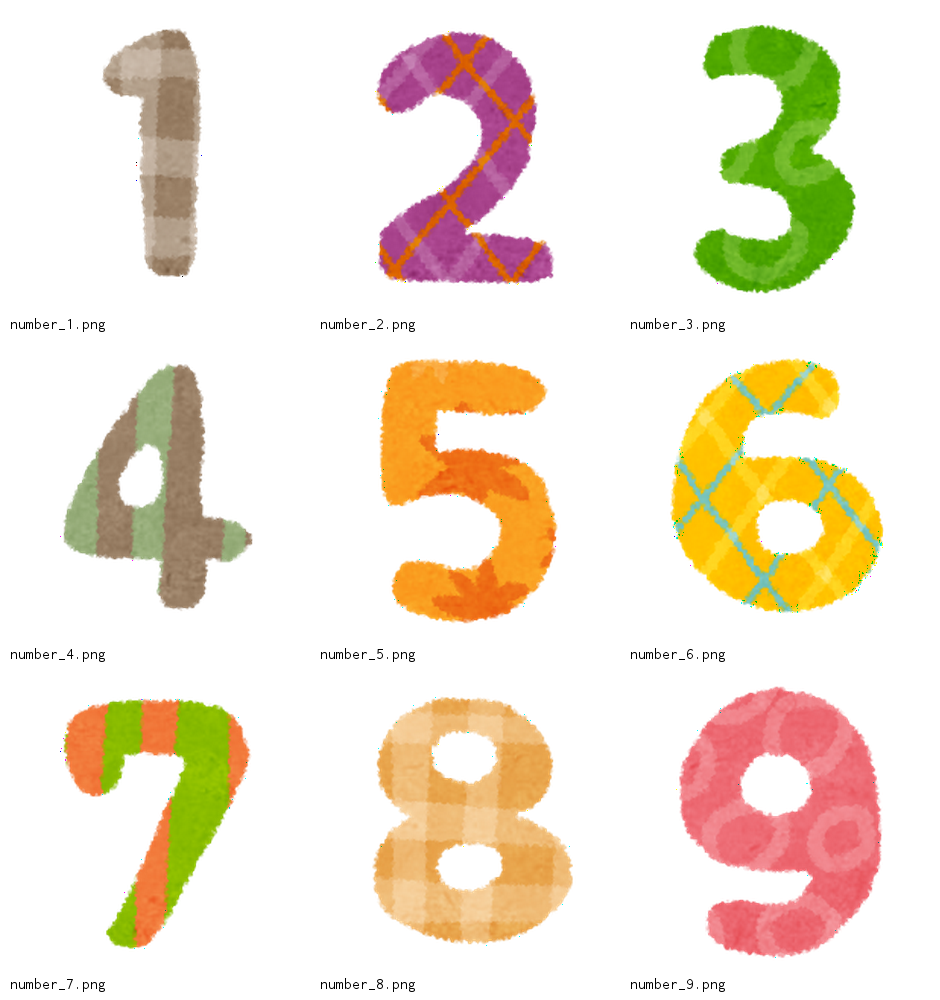

# Image Summarizer

このツールは、指定したディレクトリ内の画像からランダムに `n×n` 枚の画像を選び、ファイル名でソートした上で、アスペクト比を保ったまま白い余白とファイル名を付けてコラージュ画像を生成します。また、表示用のフォントとして、`inconsolata`フォントを使用しています。

## 特徴

- 対応画像形式：JPEG, PNG, GIF, BMP
- 指定ディレクトリ内の画像をランダムに n×n 枚選択し、その後ファイル名順にソートして配置
- アスペクト比を維持したまま各画像をリサイズ
- 画像同士の間に余白を挿入し、各画像の下にファイル名を描画
- `inconsolata` フォントを使用し、見やすいテキスト表示

## 必要な環境

- Go 1.23 以上推奨

## 使い方

以下は、`n=3` で `3×3=9枚` の画像を使用し、`300px` のタイルサイズで `output.png` に出力する例です。

samplesディレクトリ配下にある9枚の画像が1枚の画像に集約されます。

```bash
go run main.go -dir ./samples -out output.png -n 3
```

- 出力



オプション一覧:

- -dir: 画像を含むディレクトリパス（必須）
- -out: 出力ファイル名 (.png または .jpg / .jpeg)
- -n: 縦横の枚数 (n×n)
- -tile: 各画像タイルの表示領域（ピクセル単位）


